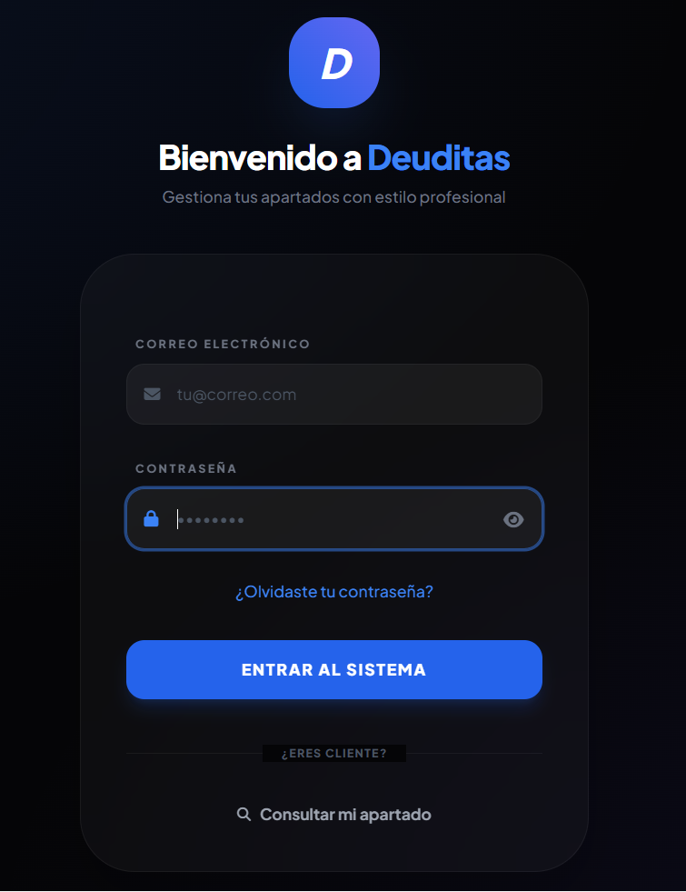
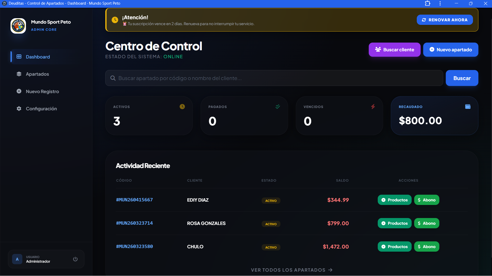
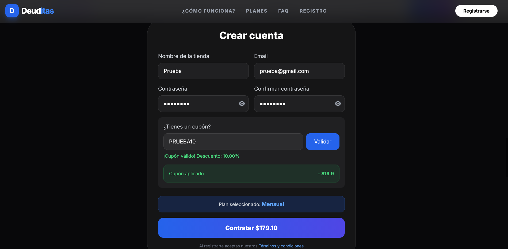
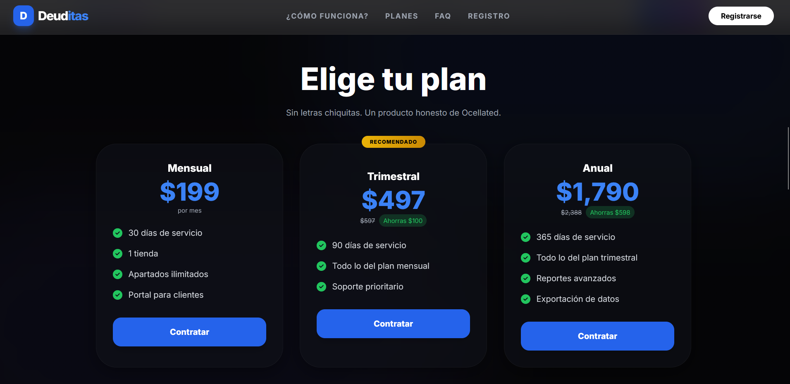

# 💳 Deuditas - Sistema de Apartados

Sistema web multi-tenant para la gestión de apartados, control de pagos y administración de clientes por tienda.

## 🚀 Tecnologías
- Laravel (PHP)
- MySQL
- JavaScript
- HTML5
- PWA (Progressive Web App)

## 🔐 Funcionalidades
- Sistema de autenticación (login de usuarios)
- Gestión de roles:
  - Super administrador
  - Administrador de tienda
- Registro de clientes
- Creación de apartados
- Control de pagos y deudas
- Seguimiento de estados de pago
- Generación de tickets en PDF
- Generación de enlace para envío de tickets vía WhatsApp con mensaje predefinido
- Sistema multi-tenant
- Integración de pagos en línea mediante Mercado Pago
- Gestión de planes y suscripciones
- Instalable como aplicación (PWA)

## 🧠 Características técnicas
- Arquitectura MVC
- CRUD completo
- Manejo de sesiones
- Base de datos relacional (MySQL)
- Validaciones de datos
- Generación dinámica de documentos PDF
- Integración con plataforma de pagos (Mercado Pago)
- Implementación de middleware para control de acceso basado en estado de suscripción
- Lógica de expiración de planes y restricción de acceso al sistema
- Configuración como Progressive Web App (PWA)

## ⚙️ Instalación

git clone https://github.com/Samy-sosa/Deuiditas.git  
cd Deuiditas  
composer install  
cp .env.example .env  
php artisan key:generate  
php artisan migrate  
php artisan serve  

---

## 📸 Capturas del sistema

### 🔐 Login

### 📊 Dashboard

### 🧾 Crear cuenta

### 💳 Planes

---

## 📱 PWA (Aplicación instalable)

El sistema puede instalarse como aplicación en dispositivos móviles o escritorio gracias a su configuración como Progressive Web App (PWA), permitiendo una experiencia similar a una app nativa.

## 👨‍💻 Autor
Samy Sosa
